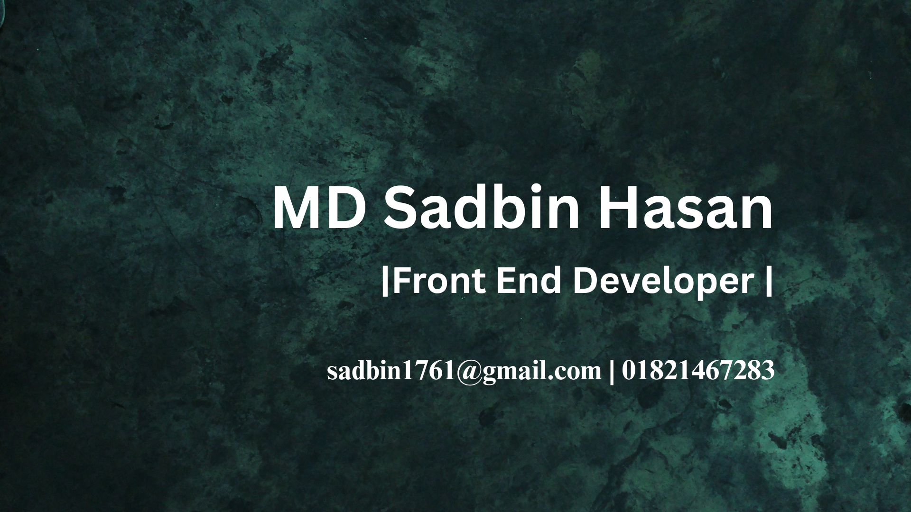

<h1 align="center">
  
</h1>

<h1 align="center">Hi 👋, I'm MD Sadbin Hasan</h1>
  <h3 align="center">A passionate frontend developer</h3>
  

   
  🔬 I am currently studying Master of Science in Electrical and Electronic Engineering at the University of Dhaka.
   
  🎓 I graduated from University of Dhaka, Department of Electrical and Electronic Engineering 
   
  🛠 &nbsp;I’m currently working with <strong>JS, React, Express, MongoDB.</strong>
     
  📫 How to reach me: <a href="mailto:sadbin1761@gmail.com">sadbin1761@gmail.com</a>
  

<h3 align="center">Connect with me:</h3>

<h3 align="center">Languages and technologies</h3>

<!-- Optional logo at the top -->
<!-- 

  

 -->

<!-- Optional MATLAB badge (static) -->
<!-- 

  

 -->

<!-- Two-column table of skill sections -->
<table align="center" style="width:100%; border-collapse:collapse; max-width:900px; margin:auto;">
  <tr>
    <!-- Column A -->
    <td style="width:50%; vertical-align:top; padding:6px;">
      

        <!--  -->
        

          <strong>Frontend Technologies</strong> 
          
        

      

    </td>
    <!-- Column B -->
  <td style="width:50%; vertical-align:top; padding:6px;">
      

        <!--  -->
        

          <strong>Back-End Technologies</strong> 
          
        

      

    </td>
  </tr>

  <tr>
    <td style="vertical-align:top; padding:6px;">
      

        <!--  -->
        

          <strong>Database Technologies</strong> 
          
        

      

    </td>
    <td style="vertical-align:top; padding:6px;">
      

        <!--  -->
        

          <strong>Office & Documentation</strong> 
          
        

      

    </td>
  </tr>

  <tr>
    <td style="vertical-align:top; padding:6px;">
      

        <!--  -->
        

          <strong>Other Languages</strong> 
          
        

      

    </td>

  <td style="vertical-align:top; padding:6px;">
      

        <!--  -->
        

          <strong>Specialized Technologies</strong> 
          
        

      

    </td>
  </tr>

  <tr>
    <td style="vertical-align:top; padding:6px;">
      

        <!--  -->
        

          <strong>Illustration Tools</strong> 
          
        

      

    </td>

  <td style="vertical-align:top; padding:6px;">
      

        <!--  -->
        

          <strong>Productivity Tools</strong> 
          
        

      

    </td>
  </tr>
</table>
 
<h3 align='center'> Github Stats </h3>

&nbsp;
 
